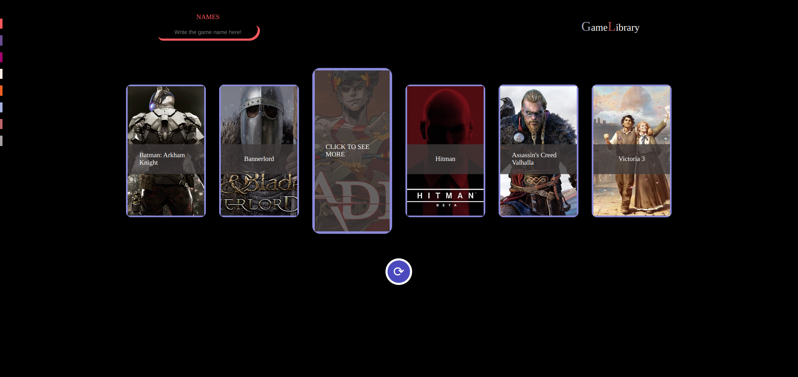
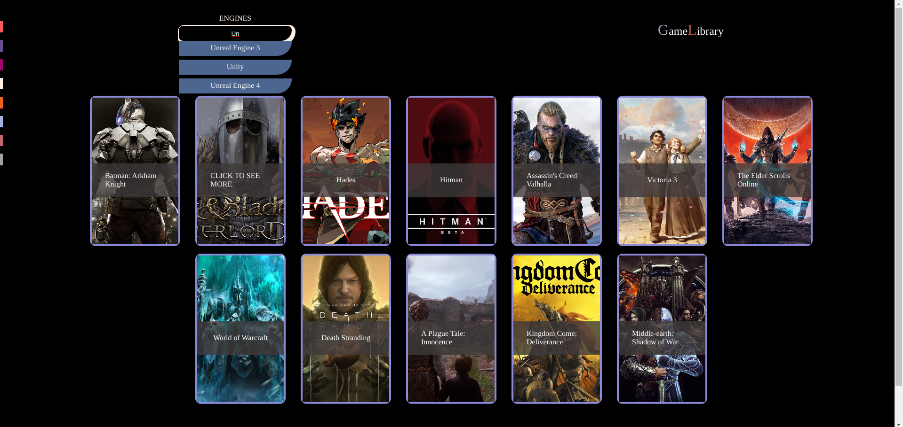
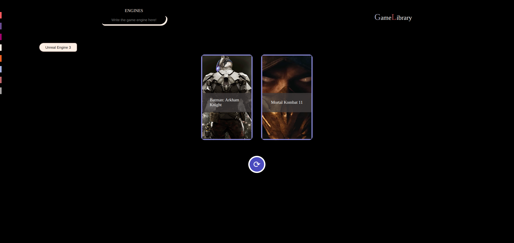

# FILTER PROJECT

## DATABASE PRACTICE PROJECT NO: 2

1. A fullstack version of my previous frontend project to practice my skills using Javascript, NodeJS, ExpressJS, MongoDB, HTML, CSS.

2. Code will not work without my password to mongodb cloud which I don't upload to github.

3. You can filter the games by your desire from the menu on left to choose an option.

4. You can select multiple filters to search for.

5. You can bring new games if there are any by clicking arrow button.

6. You can delete the filter option by removing x button on it.
